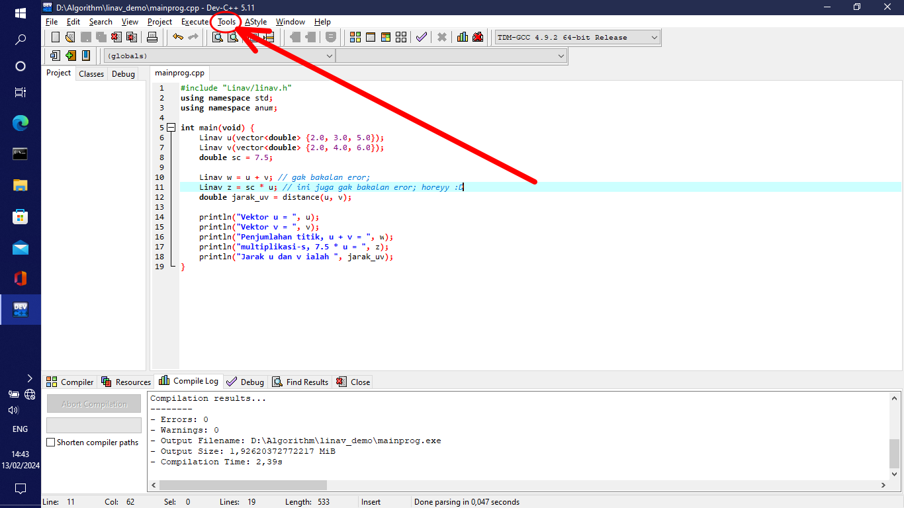
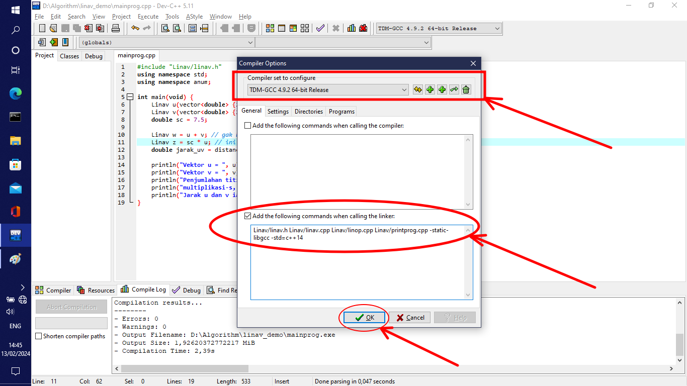

# Linav

**A C++ header as an extension of `std::vector<double>`**

----


## Usage

Suppose that we have the following code

```cpp
#include <vector>
using namespace std;

int main(void) {
	vector<double> u {2.0, 3.0, 5.0};
	vector<double> v {2.0, 4.0, 6.0};
	double sc = 7.5;
	
	vector<double> w = u + v; // produce an error;
	vector<double> z = sc * v; // also produce and error;
}
```

In this particluar case, we want that `u + v = (2.0 + 2.0, 3.0 + 4.0, 5.0 + 6.0)`. Instead, we got an error, and so for `7.5 * v`.

By using `linav.h`, we can treate `std::vector<double>` as a vector in linear algebra, i.e., a vector equipped with pointwise addition and s-multiplication. So, by include `linav.h`, the following code will not get an error.

<div id="src_linav_demo">

```cpp
#include "Linav/linav.h"
using namespace std;
using namespace anum;

int main(void) {
	Linav u(std::vector<double> {2.0, 3.0, 5.0});
	Linav v(std::vector<double> {2.0, 4.0, 6.0});
	double sc = 7.5;
	
	Linav w = u + v; // Compute the pointwise addition
	Linav z = sc * v; // s-multiplication
	Linav uv_distance = distance(u, v); // Euclidean distance
	
	// print the results
	println("u vector, u = ", u);
	println("v vector, v = ", v);
	println("Pointwise addition, u + v = ", w);
	println("s-multiplication, 7.5 * v = ", z);
	println("The distance of u and v are ", uv_distance);
}
```

</div>

## How to use `linav.h`

### Linux

Requirements:
1. C++ compiler (in this example, we use g++)
2. git
2. Terminal
3. Text editor (I use VIM btw)

Steps:

1. Create a new folder having your purpose as the name of the folder, e.g., `linav_demo`.

2. Open terminal and change directory to this new folder and then clone this repository by type this command in the terminal.

```
git clone https://github.com/m-RezaFahlevi/Linav
```

3. After that, create a new file name `mainprog.cpp`. So, in this example, our `linav_demo` directory contains `Linav` folder and `mainprog.cpp`.
4. Create two new bash script, `compandrun.sh` and `compfile.sh`. `compandrun.sh` is a bash script for compile and run the program. And `compfile.sh` is a bash script for compile the program only.
5. The following is a code for `compfile.sh`

```
echo "g++ Linav/linav.h Linav/linav.cpp Linav/linop.cpp Linav/printprog.cpp mainprog.cpp -o mainprog -O2 --time";
g++ Linav/linav.h Linav/linav.cpp Linav/linop.cpp Linav/printprog.cpp mainprog.cpp -o mainprog -O2 --time;
```

6. The following is a code for `compandrun.sh`

```
echo "g++ Linav/linav.h Linav/linav.cpp Linav/linop.cpp Linav/printprog.cpp mainprog.cpp -o mainprog -O2";
g++ Linav/linav.h Linav/linav.cpp Linav/linop.cpp Linav/printprog.cpp mainprog.cpp -o mainprog -O2;
./mainprog
```


7. Open `mainprog.cpp`
8. For the purpose of demonstration only, copy, paste and save [linav demo sources code](#src_linav_demo) above.
9. Open termnal and then go to `linav_demo` directory. Type`./compfile` for compile the program only, and type `./compandrun.sh` for compile and run the program.

### Windows 10

The easiest way to use `linav.h` is by using [Dev-C++](https://www.bloodshed.net/) IDE.

Requirements:
1. [Dev-C++](https://www.bloodshed.net/)

Steps:

1. Create a new folder having your purpose as the name of this new folder, e.g., `linav_demo`.
2. Create a new file having `mainprog.cpp` as its name.
3. In this new folder, clone this Linav repository. So, in this new folder contains `Linav`'s folder and `mainprog.cpp`.
4. Open your DevCpp and open `mainprog.cpp`.
5. For the purpose of demonstration only, copy, paste, and save [linav demo sources code](#src_linav_demo) above.
6. Before you compile this program, open tab `Tools>compiler`



7. Checkbox 

> Add the following commands when calling the linker:

and in its textarea copy and paste the following commands

```
Linav/linav.h Linav/linav.cpp Linav/linop.cpp Linav/printprog.cpp -static-libgcc -std=c++14
```

Therefore, we should have a configuration for Compiler Options's like the figure below.



8. After that, compile the program it should show no error in its compile log.
9. Run the program.


See *[Linav: Computation of Vectors in Linear Algebra](https://www.fahlevisia.com/post_articles/Linav/)* for more details about `linav.h`.